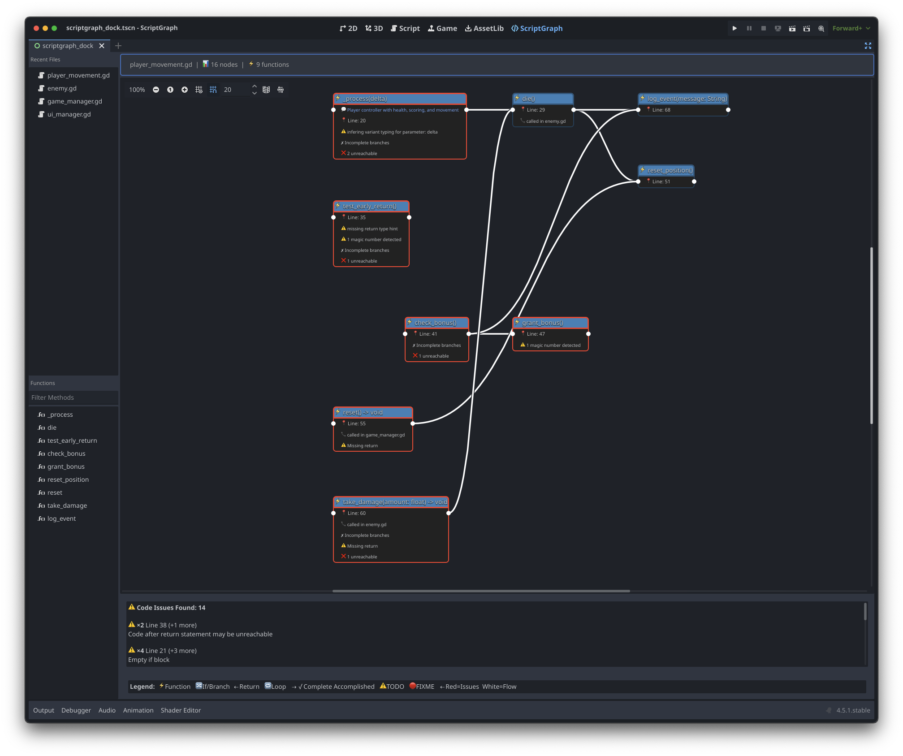

<div align="center">


# ScriptGraph

**Visual Flow Analysis for GDScript in Godot 4**


[💖 Sponsor](https://github.com/sponsors/nawillcodes) • [Buy me a Coffee ☕](https://ko-fi.com/naimwilliams)

</div>

---

## 🎯 What is ScriptGraph?

ScriptGraph is a **read-only visual debugger** for GDScript that transforms your code into an interactive flowchart. It helps you:

- 🔍 **Debug** complex logic by visualizing control flow
- 📚 **Learn** from existing code more quickly
- ⚠️ **Detect** potential issues (unreachable code, empty blocks, etc.)
- 🧠 **Understand** code structure at a glance

**ScriptGraph is NOT:**
- ❌ A visual scripting language
- ❌ A code editor or generator
- ❌ A replacement for the Script tab

---

## 📸 See It In Action

<div align="center">


*Visual flow graph showing function relationships, cross-reference analysis, and code quality warnings*
</div>

---

## ❤️ Support This Open-Source Project

This project is a labor of love. If it helps you or your team, please consider supporting development:

👉 **[GitHub Sponsors](https://github.com/sponsors/nawillcodes)** - Monthly or one-time support  
👉 **[Ko-fi](https://ko-fi.com/naimwilliams)** - Buy me a coffee ☕

Your support helps maintain and improve ScriptGraph for the entire Godot community!

---

## 🚀 Quick Start

### Installation

1. **Download or clone** this repository
2. **Copy** the `addons/scriptgraph/` folder into your Godot project's `addons/` directory
3. **Open your project** in Godot 4
4. Go to **Project → Project Settings → Plugins**
5. **Enable** "ScriptGraph"
6. The ScriptGraph dock will appear in your editor!

### First Use

1. Click any `.gd` file in the FileSystem dock
2. Switch to the **ScriptGraph** tab in the editor
3. View your code as a visual flow graph!

> **💡 Pro Tip:** Click the **"Arrange nodes"** button (grid icon) in the GraphEdit toolbar to automatically organize the layout. This reveals the full beauty of the graph and makes function relationships crystal clear!

---

## 📸 Features

### Current (MVP v0.1.0)

- ✅ **Visual Flow Graphs** - See functions, conditionals, loops, and returns
- ✅ **Auto-Arrange** - Use GraphEdit's "Arrange nodes" to see the magic! ✨
- ✅ **Issue Detection** - Highlights unreachable code, empty blocks, deep nesting
- ✅ **Read-Only** - Safe, non-destructive analysis
- ✅ **Native UI** - Uses Godot's GraphEdit component
- ✅ **Color-Coded Nodes** - Easy identification of node types

### Coming Soon

- 🔜 Click node → jump to line in editor
- 🔜 Export graph as PNG/SVG
- 🔜 Variable tracking
- 🔜 Function call graph
- 🔜 Performance hints

---

## 🎨 Node Types & Colors

| Color | Type | Description |
|-------|------|-------------|
| 🔵 Blue (#478CBF) | Function | Function definitions |
| 🟠 Orange (#FF8C00) | Conditional | if/elif/else statements |
| 🟢 Green (#4CAF50) | Loop | for/while loops |
| 🟣 Purple (#9C27B0) | Return | return statements |
| 🔴 Red (#F44336) | Warning | Issues detected |

---

## ⚠️ Warning Detection

ScriptGraph automatically detects:

- **Unreachable Code** - Code after `return` statements
- **Empty Blocks** - if/else/loops with no body
- **Deep Nesting** - More than 3 levels of indentation
- **Missing Returns** - Functions missing return statements in some paths

---

## 📁 Project Structure

```
script-graph/
├── addons/
│   └── scriptgraph/          # The addon
│       ├── plugin.cfg        # Plugin metadata
│       ├── plugin.gd         # EditorPlugin entry
│       ├── ui/               # Dock UI
│       ├── core/             # Model & Renderer
│       ├── parser/           # GDScript parser
│       └── analyzer/         # Code analysis
├── docs/                     # Documentation
│   ├── README.md             # Main docs
│   ├── ARCHITECTURE.md       # Technical details
│   ├── USER_GUIDE.md         # User manual
│   └── DEVELOPMENT.md        # Developer guide
├── tests/
│   └── test_scripts/         # Sample GDScript files
└── README.md                 # This file
```

---

## 🧪 Testing

Test scripts are included in `tests/test_scripts/`:

- `simple_function.gd` - Basic function example
- `nested_conditions.gd` - Deep conditionals
- `unreachable_code.gd` - Code after return (triggers warnings)
- `empty_blocks.gd` - Empty if/else blocks (triggers warnings)
- `loops.gd` - For/while loop examples
- `missing_return.gd` - Missing return paths (triggers warnings)

**To test:**
1. Open any test script in the FileSystem
2. View it in ScriptGraph
3. **Click "Arrange nodes"** (grid icon) in the toolbar to auto-organize
4. Verify the graph structure and warnings

> **✨ Tip:** The arrange nodes feature instantly reveals the full structure - function call relationships become immediately visible!

---

## 📚 Documentation

- [**README.md**](./docs/README.md) - Full addon documentation
- [**ARCHITECTURE.md**](./docs/ARCHITECTURE.md) - Technical architecture
- [**USER_GUIDE.md**](./docs/USER_GUIDE.md) - How to use ScriptGraph
- [**DEVELOPMENT.md**](./docs/DEVELOPMENT.md) - Developer guide

---

## 🛠️ Technical Details

### Parser

**Current (MVP):** Regex-based pattern matching
- Detects functions, if/elif/else, loops, returns
- Tracks indentation for nesting

**Future:** Integration with gdscript-toolkit for full AST parsing

### Renderer

Uses Godot's native `GraphEdit` and `GraphNode` components with:
- Hierarchical layout (top-to-bottom)
- Color-coded nodes
- Warning highlights

### Analyzer

Implements rule-based analysis:
- Control flow checks
- Return path validation
- Complexity detection

---

## 🤝 Contributing

Contributions welcome! Please:

1. Fork the repository
2. Create a feature branch
3. Maintain the **read-only philosophy**
4. Add tests for new features
5. Update documentation
6. Submit a pull request

---

## 📄 License

MIT License - See LICENSE file for details

---

## 🙏 Credits

- **Godot Engine** - For the amazing open-source game engine
- **gdscript-toolkit** - Inspiration for AST parsing approach
- **Orchestrator** - Inspiration for visual script tools

---

## 💬 Support

- **Issues**: [GitHub Issues](https://github.com/yourusername/script-graph/issues) *(coming soon)*
- **Discussions**: [GitHub Discussions](https://github.com/yourusername/script-graph/discussions) *(coming soon)*
- **Discord**: *(coming soon)*

---

## 🚧 Roadmap

### Phase 1: MVP ✅
- [x] Basic flow visualization
- [x] Simple parser
- [x] Warning detection
- [x] Read-only GraphEdit

### Phase 2: Enhanced Analysis
- [ ] Variable scope tracking
- [ ] Function call graph
- [ ] Click to jump to code
- [ ] Export graphs

### Phase 3: Performance
- [ ] Large file optimization
- [ ] Incremental parsing
- [ ] Caching

### Phase 4: Advanced
- [ ] Real-time updates
- [ ] Multi-file analysis
- [ ] Custom themes
- [ ] Plugin API

---

**Built with ❤️ for the Godot community**

**ScriptGraph - Visualize your code, debug your logic </•>**
